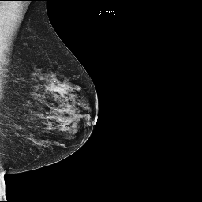
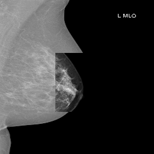

# RSNA Screening Mammography Breast Cancer Detection

## Description
The goal of this competition is to identify breast cancer. You'll train your model with screening mammograms obtained from regular screening.

Your work improving the automation of detection in screening mammography may enable radiologists to be more accurate and efficient, improving the quality and safety of patient care. It could also help reduce costs and unnecessary medical procedures.

## Data
The goal of this competition is to identify cases of breast cancer in mammograms from screening exams. 
It is important to identify cases of cancer for obvious reasons, but false positives also have downsides for patients. 
As millions of women get mammograms each year, a useful machine learning tool could help a great many people.
Here is an example of a non-cancer (left) and a cancer (right) images.

    
    

The data is composed by 54706 annotated images but the dataset is highly unbalenced.

    

To deal witj unbaleced data we implemented 2 tricks: 

1 - label smoothing

2 - weighted loss function

## Model

We decided to used SwinV2 as classifier model. SwinV2 is the second version of the Microsoft Visual Transformer (ViT).
This model is different from the original one by using shifted window approach. 

As recommended to train a ViT, we used 4 data augmentations techniques:

1 - RandAugment : 

    

2 - RandomErasing

    

3 - CutMix

    

4 - Mixup

    

## References